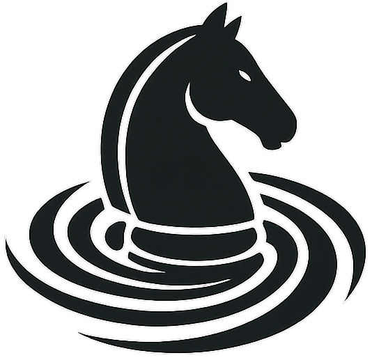

# Maelstrom

  

UCI-compliant Golang chess engine in development from scratch. This is my first experience coding in Go, and so far it's been awesome!

## Watch games
Maelstrom often plays on Lichess, and you can watch recent or live games and view ratings [here](https://maelstrom-monitor.netlify.app/)! You can check out the source code of the monitoring website [here](https://github.com/saisree27/maelstrom-website).

## Features
 - Fast bitboard move generation (magic bitboards for sliding pieces)
 - Iterative deepening principal variation search
 - Null move pruning and transposition table
 - Move ordering with captures, history, and killer heuristic
 - Late move reductions
 - Quiescence search
 - Evaluation utilizing material, piece square tables, pawn structure, and more 
 - UCI protocol implementation, so you can run the engine using a UCI-supported GUI such as [CuteChess](https://github.com/cutechess/cutechess/releases).

## Releases
I have included binaries for Windows, MacOS, and Linux in the Releases section. This is currently Maelstrom's first release (v1.0.0), and I would welcome any bugs or problems reported through the Issues tab!

Maelstrom is also playable on Lichess! You can play against it [here](https://lichess.org/@/Maelstrom-Chess). Maelstrom accepts both casual and rated play of all time controls. Maelstrom plays with an opening book on Lichess to allow for some more varied positions.

## Building from Source
Clone the repository, then run `go build maelstrom/main.go`. The engine binary will be built into the project root folder.

## Upcoming Development
There's definitely a couple more things I plan to work on for the next (and future) release. Initially I had planned to do all of these before release, but I wanted to share an initial version and take a quick break to work on other things. 
- Optimizations (most important!)
- Multithreading
- Better endgame evaluation
- Improving transposition table implementation

## Game Selections
Take a look at this epic of a [game](https://lichess.org/mcJxLCE8) played on Lichess between Maelstrom and another bot (Lynx). This game lasted 250(!) moves, with both sides refusing to draw!

## References
Definitely the most helpful reference in developing this engine for me has been the Chess Programming [wiki](https://www.chessprogramming.org/Main_Page)! If you're interested in developing your own chess engine or move library, this website has everything.
